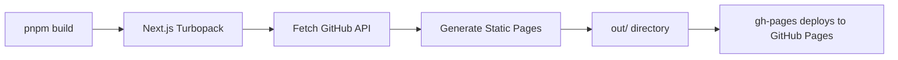
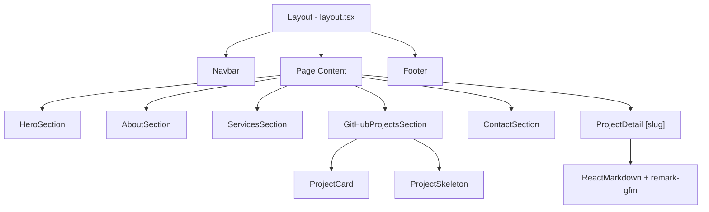

<p align="center">
  
</p>

<h1 align="center">Amr Elshabrawy — Portfolio</h1>

<p align="center">
  <strong>A modern, high-performance developer portfolio built with Next.js 16, React 19 & Tailwind CSS v4</strong>
</p>

<p align="center">
  <a href="https://amrelshabrawydev.github.io"></a>
  
  
  
  
</p>

---

## 📖 Table of Contents

- [Overview](#-overview)
- [Live Demo](#-live-demo)
- [Tech Stack & Why](#-tech-stack--why)
- [Project Structure](#-project-structure)
- [How It Works](#-how-it-works)
- [Data Fetching Strategy](#-data-fetching-strategy)
- [Styling & Design System](#-styling--design-system)
- [Components Architecture](#-components-architecture)
- [SEO & Performance](#-seo--performance)
- [Deployment](#-deployment)
- [Getting Started](#-getting-started)
- [Environment Variables](#-environment-variables)
- [Scripts](#-scripts)
- [License](#-license)

---

## 🌟 Overview

A fully static, blazing-fast developer portfolio that **automatically syncs with GitHub** to showcase projects. No CMS, no database — just push to GitHub and your portfolio updates itself on the next build.

### ✨ Key Features

| Feature                   | Description                                                                   |
| ------------------------- | ----------------------------------------------------------------------------- |
| **Auto-Synced Projects**  | Fetches all repositories from GitHub API at build time — no manual data entry |
| **Dynamic Project Pages** | Each repo gets its own detail page with full README rendering                 |
| **Contact Form**          | Functional email form powered by EmailJS — no backend needed                  |
| **Responsive Design**     | Pixel-perfect on every device, from 320px to 4K                               |
| **Dark Cosmic Theme**     | Custom dark theme with glassmorphism, gradients, and glow effects             |
| **Smooth Animations**     | Page transitions, scroll-triggered reveals, and micro-interactions            |
| **Full SEO**              | Structured data (JSON-LD), Open Graph, Twitter Cards, sitemap, robots.txt     |
| **Static Export**         | Pre-rendered to pure HTML/CSS/JS — deploys anywhere                           |

---

## 🔗 Live Demo

👉 **[amrelshabrawydev.github.io](https://amrelshabrawydev.github.io)**

---

## 🛠️ Tech Stack & Why

### Core Framework

| Technology                                        | Version   | Why We Use It                                                                                                                  |
| ------------------------------------------------- | --------- | ------------------------------------------------------------------------------------------------------------------------------ |
| **[Next.js](https://nextjs.org/)**                | `16.0.10` | App Router, static export (`output: "export"`), file-based routing, built-in image optimization, and Turbopack for fast builds |
| **[React](https://react.dev/)**                   | `19.2.0`  | Latest concurrent features, server components, improved performance with automatic batching                                    |
| **[TypeScript](https://www.typescriptlang.org/)** | `5.x`     | Type safety across the entire codebase — catches bugs at compile time, improves DX with autocomplete                           |

### Styling

| Technology                                                      | Why We Use It                                                                                                                |
| --------------------------------------------------------------- | ---------------------------------------------------------------------------------------------------------------------------- |
| **[Tailwind CSS v4](https://tailwindcss.com/)**                 | Utility-first CSS with the new `@theme` directive for design tokens. Zero runtime CSS — everything is compiled at build time |
| **[tailwind-merge](https://github.com/dcastil/tailwind-merge)** | Intelligently merges conflicting Tailwind classes (e.g., `px-4` + `px-6` → `px-6`)                                           |
| **[class-variance-authority](https://cva.style/)**              | Type-safe component variant APIs (used by shadcn/ui Button, Badge, etc.)                                                     |
| **[clsx](https://github.com/lukeed/clsx)**                      | Conditional class name composition — cleaner than template literals                                                          |

### UI Components

| Technology                                          | Why We Use It                                                                                                                                                                                 |
| --------------------------------------------------- | --------------------------------------------------------------------------------------------------------------------------------------------------------------------------------------------- |
| **[shadcn/ui](https://ui.shadcn.com/)**             | Pre-built, accessible, customizable components (Button, Card, Tabs, Dialog, Tooltip, Badge, Input, Textarea). Not a dependency — components are copied into `components/ui/` for full control |
| **[Radix UI](https://www.radix-ui.com/)**           | Headless, accessible primitives that power shadcn/ui (Dialog, Tabs, Tooltip, Slot)                                                                                                            |
| **[Lucide React](https://lucide.dev/)**             | Beautiful, consistent SVG icon set with tree-shaking — only imports icons we use                                                                                                              |
| **[Framer Motion](https://www.framer.com/motion/)** | Declarative animations: page transitions, scroll-triggered reveals, layout animations, and hover micro-interactions                                                                           |

### Data & Communication

| Technology                                                | Why We Use It                                                                                                  |
| --------------------------------------------------------- | -------------------------------------------------------------------------------------------------------------- |
| **[GitHub REST API v3](https://docs.github.com/en/rest)** | Fetches all public repositories, language stats, and README content at build time                              |
| **[EmailJS](https://www.emailjs.com/)**                   | Sends contact form emails directly from the browser — no backend, no server functions needed for static export |

### Markdown Rendering

| Technology                                                                                           | Why We Use It                                                                   |
| ---------------------------------------------------------------------------------------------------- | ------------------------------------------------------------------------------- |
| **[react-markdown](https://github.com/remarkjs/react-markdown)**                                     | Renders GitHub README files as React components                                 |
| **[remark-gfm](https://github.com/remarkjs/remark-gfm)**                                             | GitHub Flavored Markdown support (tables, strikethrough, task lists, autolinks) |
| **[rehype-raw](https://github.com/rehypejs/rehype-raw)**                                             | Allows raw HTML in markdown (for badges, images, etc.)                          |
| **[rehype-sanitize](https://github.com/rehypejs/rehype-sanitize)**                                   | Sanitizes HTML to prevent XSS attacks                                           |
| **[react-syntax-highlighter](https://github.com/react-syntax-highlighter/react-syntax-highlighter)** | Syntax highlighting for code blocks inside READMEs                              |

### DevOps & Deployment

| Technology                                          | Why We Use It                                                            |
| --------------------------------------------------- | ------------------------------------------------------------------------ |
| **[gh-pages](https://github.com/tschaub/gh-pages)** | Publishes the `out/` directory to the `gh-pages` branch with one command |
| **[GitHub Pages](https://pages.github.com/)**       | Free, reliable static hosting with HTTPS and custom domain support       |
| **[ESLint](https://eslint.org/)**                   | Code quality and consistency enforcement                                 |
| **[pnpm](https://pnpm.io/)**                        | Fast, disk-efficient package manager                                     |

---

## 📁 Project Structure

```
amrelshabrawydev/
├── app/                          # Next.js App Router
│   ├── layout.tsx                # Root layout (fonts, metadata, navbar, footer)
│   ├── page.tsx                  # Home page → HeroSection
│   ├── globals.css               # Design system (theme tokens, utilities, animations)
│   ├── robots.ts                 # Dynamic robots.txt generation
│   ├── sitemap.ts                # Dynamic sitemap.xml generation
│   ├── about/page.tsx            # About page → AboutSection
│   ├── services/page.tsx         # Services page → ServicesSection
│   ├── work/
│   │   ├── page.tsx              # Work page → GitHubProjectsSection
│   │   └── [slug]/page.tsx       # Dynamic project detail pages
│   ├── contact/page.tsx          # Contact page → ContactSection
│   └── api/
│       └── github-projects/route.ts  # API route for client-side project fetching
│
├── components/
│   ├── Layout/
│   │   ├── Footer.tsx            # Site footer with social links
│   │   └── PageTransition.tsx    # Framer Motion animation variants
│   ├── Navigation/
│   │   └── Navbar.tsx            # Responsive navbar with mobile menu
│   ├── Sections/
│   │   ├── HeroSection.tsx       # Hero with typewriter animation
│   │   ├── AboutSection.tsx      # Skills, experience, and bio
│   │   ├── ServicesSection.tsx   # Services offered
│   │   ├── ContactSection.tsx    # EmailJS-powered contact form
│   │   ├── GitHubProjectsSection.tsx  # Project grid (client-side fetch)
│   │   └── GitHubProjects/
│   │       ├── ProjectCard.tsx   # Individual project card
│   │       └── ProjectSkeleton.tsx  # Loading skeleton
│   └── ui/                       # shadcn/ui components
│       ├── button.tsx, badge.tsx, card.tsx, dialog.tsx
│       ├── input.tsx, textarea.tsx, tabs.tsx, tooltip.tsx
│       ├── glass-card.tsx        # Custom glassmorphic card
│       ├── markdown-components.tsx  # Custom markdown renderers
│       └── type-animation.tsx    # Typewriter effect component
│
├── lib/
│   ├── github.ts                 # GitHub API service (fetch repos, READMEs)
│   ├── metadata.ts               # Centralized SEO metadata & JSON-LD schemas
│   └── utils.ts                  # Utilities (cn, formatDate, generateSlug)
│
├── data/
│   └── index.tsx                 # Static data (personal info, skills, services, social links)
│
├── types/
│   └── github.ts                 # TypeScript interfaces (Project, Language)
│
├── public/                       # Static assets
│   ├── .nojekyll                 # Tells GitHub Pages to serve _next/ directory
│   ├── logo.svg, profile.png     # Branding
│   ├── og-*.png, twitter-card.png  # Social sharing images
│   ├── favicon.*, apple-touch-icon.png  # Favicons
│   └── site.webmanifest          # PWA manifest
│
├── next.config.ts                # Next.js config (static export, image patterns)
├── tsconfig.json                 # TypeScript strict configuration
├── postcss.config.mjs            # PostCSS with Tailwind plugin
├── eslint.config.mjs             # ESLint configuration
└── package.json                  # Dependencies & scripts
```

---

## ⚙️ How It Works

### Build Pipeline



1. **`pnpm build`** triggers Next.js static export (`output: "export"`)
2. **Turbopack** compiles TypeScript and bundles assets
3. **`generateStaticParams()`** in `app/work/[slug]/page.tsx` calls `getAllProjects()` which fetches all repos from GitHub API
4. **Each repo** gets its own static HTML page at `/work/{slug}`
5. **Output** is a fully static `out/` directory (HTML, CSS, JS, images)
6. **`pnpm run deploy`** pushes `out/` to the `gh-pages` branch via `gh-pages --nojekyll`

### Runtime Behavior

- **Project listing page** (`/work`): Fetches projects client-side via `/api/github-projects` route for fresh data
- **Project detail pages** (`/work/[slug]`): Pre-rendered at build time with full README content
- **Contact form**: Sends emails client-side via EmailJS SDK — no server roundtrip
- **Navigation**: Client-side routing via Next.js App Router with Framer Motion page transitions

---

## 🔄 Data Fetching Strategy

### 1. GitHub Projects (Build-Time + Client-Side Hybrid)

```
┌─────────────────────────────────────────────────────────────┐
│                    lib/github.ts                            │
│                                                             │
│  fetchWithToken(url)                                        │
│  ├── Adds Bearer token if GITHUB_TOKEN is set               │
│  ├── Uses next: { revalidate: 3600 } (1-hour cache)         │
│  └── Handles rate limiting gracefully                       │
│                                                             │
│  getAllProjects()                                           │
│  ├── GET /users/{username}/repos?sort=updated&per_page=100  │
│  ├── Filters out forked repos                               │
│  ├── Fetches language stats per repo                        │
│  ├── Generates OG image URL from GitHub                     │
│  └── Returns Project[] with title, description, etc.        │
│                                                             │
│  getProjectReadme(fullName, branch)                         │
│  ├── GET /repos/{fullName}/readme?ref={branch}              │
│  ├── Decodes Base64 content                                 │
│  └── Extracts preview text for meta descriptions            │
└─────────────────────────────────────────────────────────────┘
```

**Why hybrid?**

- **Build time** (`generateStaticParams`): Pre-renders all project detail pages with README content for instant loading and SEO
- **Client side** (`GitHubProjectsSection`): Fetches fresh project data on the `/work` page so visitors always see the latest repos without rebuilding

### 2. Contact Form (Client-Side via EmailJS)

```
User submits form → EmailJS SDK → EmailJS Service → Your Gmail inbox
```

- No backend required — perfect for static deployment
- Template variables: `{{from_name}}`, `{{from_email}}`, `{{message}}`
- Success/error states with loading spinner

### 3. Static Data (`data/index.tsx`)

All personal info, skills, services, and social links are defined as typed constants:

```typescript
export const personalInfo: PersonalInfo = { name, role, tagline, ... }
export const skills: Skill[] = [...]
export const services: Service[] = [...]
export const socialLinks: SocialLink[] = [...]
```

**Why?** Single source of truth. Change your bio in one file → every page updates.

---

## 🎨 Styling & Design System

### Theme Architecture

The design system is defined in `app/globals.css` using Tailwind CSS v4's `@theme` directive:

```css
@theme {
  /* Background Layers */
  --color-bg-base: #0a0e27; /* Deep dark blue */
  --color-bg-elevated: #111827; /* Cards, footer */
  --color-bg-overlay: #1f2937; /* Modals, popovers */

  /* Brand Colors */
  --color-primary-500: #3b82f6; /* Blue — CTAs, links */
  --color-accent-500: #8b5cf6; /* Purple — gradients, highlights */

  /* Text Hierarchy */
  --color-text-primary: #e0e7ff; /* Headings */
  --color-text-secondary: #94a3b8; /* Body text */
  --color-text-tertiary: #64748b; /* Captions */
}
```

### Visual Effects

| Effect              | Implementation                                                          |
| ------------------- | ----------------------------------------------------------------------- |
| **Glassmorphism**   | `.glass-card` — `rgba` background + `backdrop-filter: blur(12px)`       |
| **Gradient Text**   | `.gradient-text` — `background-clip: text` with primary→accent gradient |
| **Glow Effects**    | `.glow-subtle/medium/strong` — Layered `box-shadow` with brand colors   |
| **Grid Pattern**    | `.bg-grid-pattern` — CSS `linear-gradient` creating a subtle grid       |
| **Mesh Gradient**   | `--gradient-mesh` — Multiple `radial-gradient` layers for depth         |
| **Float Animation** | `@keyframes float` — Gentle Y-axis oscillation on the hero image        |

### Typography

- **Headings**: [Space Grotesk](https://fonts.google.com/specimen/Space+Grotesk) — Geometric, modern feel
- **Body**: [Inter](https://fonts.google.com/specimen/Inter) — Highly legible at all sizes
- Loaded via `next/font/google` for zero layout shift (FOUT-free)

---

## 🧩 Components Architecture

### Page Sections



### UI Component Library (shadcn/ui)

All components live in `components/ui/` — they are **not** installed as dependencies but copied directly for full customization:

| Component            | Purpose                                                      |
| -------------------- | ------------------------------------------------------------ |
| `Button`             | Primary CTAs with variants (default, outline, ghost) via CVA |
| `Card`               | Content containers with header/content/footer slots          |
| `Badge`              | Technology tags, status indicators                           |
| `Dialog`             | Modal overlays (accessible, focus-trapped)                   |
| `Tabs`               | Content tabbing (e.g., skills categories)                    |
| `Tooltip`            | Hover information overlays                                   |
| `Input` / `Textarea` | Form fields with consistent styling                          |
| `GlassCard`          | Custom glassmorphic card with hover effects                  |
| `TypeAnimation`      | Typewriter effect for hero section role titles               |
| `MarkdownComponents` | Custom renderers for README code blocks, images, links       |

---

## 🔍 SEO & Performance

### SEO Features

- **Metadata** in `lib/metadata.ts`: Centralized Open Graph, Twitter Card, and description for every page
- **JSON-LD Structured Data**: `Person`, `ProfessionalService`, and `ItemList` schemas
- **Dynamic Sitemap** (`app/sitemap.ts`): Auto-generated with all routes
- **Dynamic Robots** (`app/robots.ts`): Proper crawl directives
- **Canonical URLs**: Prevent duplicate content
- **Semantic HTML**: Proper heading hierarchy, landmarks, and ARIA labels

### Performance

- **Static Export**: Zero server overhead — served directly from CDN
- **Turbopack**: Up to 10x faster builds than Webpack
- **Image Optimization**: `next/image` with `unoptimized: true` for static export (images served as-is)
- **Font Optimization**: `next/font/google` with `display: swap` and preloading
- **Code Splitting**: Automatic per-route JavaScript bundles
- **Tree Shaking**: Only imported icons/components are bundled

---

## 🚀 Deployment

### GitHub Pages (Current Setup)

The project deploys to GitHub Pages via the `gh-pages` package:

```bash
# Build + Deploy (runs predeploy → build automatically)
pnpm run deploy
```

This command:

1. Runs `next build` → generates `out/` directory
2. Pushes `out/` to the `gh-pages` branch with `--nojekyll` flag
3. GitHub Pages serves the static files from that branch

### Important Notes

- **`.nojekyll`** file in `public/` tells GitHub Pages to serve the `_next/` directory (which starts with an underscore and would normally be ignored by Jekyll)
- **`output: "export"`** in `next.config.ts` enables fully static HTML generation
- **`images.unoptimized: true`** is required because GitHub Pages doesn't support Next.js image optimization API
- **`generateStaticParams()`** in `app/work/[slug]/page.tsx` pre-renders all project detail pages

---

## 🏁 Getting Started

### Prerequisites

- **Node.js** ≥ 18
- **pnpm** (recommended) or npm

### Installation

```bash
# Clone the repository
git clone https://github.com/AmrElshabrawyDev/amrelshabrawydev.github.io.git
cd amrelshabrawydev.github.io

# Install dependencies
pnpm install

# Set up environment variables
cp .env.example .env.local
# Edit .env.local with your values (see below)

# Start development server
pnpm dev
```

Open [http://localhost:3000](http://localhost:3000) in your browser.

---

## 🔐 Environment Variables

Create a `.env.local` file in the project root:

```env
# GitHub API
GITHUB_USERNAME=YourGitHubUsername
GITHUB_TOKEN=ghp_xxxxxxxxxxxxxxxxxxxx   # Optional: increases API rate limit from 60 to 5000 req/hr

# EmailJS (for contact form)
NEXT_PUBLIC_EMAILJS_SERVICE_ID=service_xxxxxxx
NEXT_PUBLIC_EMAILJS_TEMPLATE_ID=template_xxxxxxx
NEXT_PUBLIC_EMAILJS_PUBLIC_KEY=xxxxxxxxxxxxxxx
```

| Variable                          | Required | Description                                                              |
| --------------------------------- | -------- | ------------------------------------------------------------------------ |
| `GITHUB_USERNAME`                 | ✅       | Your GitHub username for fetching repositories                           |
| `GITHUB_TOKEN`                    | ❌       | Personal access token — raises rate limit from 60 to 5,000 requests/hour |
| `NEXT_PUBLIC_EMAILJS_SERVICE_ID`  | ✅       | EmailJS service ID (get from [emailjs.com](https://emailjs.com))         |
| `NEXT_PUBLIC_EMAILJS_TEMPLATE_ID` | ✅       | EmailJS email template ID                                                |
| `NEXT_PUBLIC_EMAILJS_PUBLIC_KEY`  | ✅       | EmailJS public key for browser-side sends                                |

---

## 📜 Scripts

| Script   | Command           | Description                                                        |
| -------- | ----------------- | ------------------------------------------------------------------ |
| `dev`    | `pnpm dev`        | Start development server with Turbopack HMR                        |
| `build`  | `pnpm build`      | Create optimized static production build in `out/`                 |
| `start`  | `pnpm start`      | Start production server (for testing, not used with static export) |
| `lint`   | `pnpm lint`       | Run ESLint for code quality checks                                 |
| `deploy` | `pnpm run deploy` | Build + push to `gh-pages` branch                                  |

---

## 📄 License

This project is open source and available under the [MIT License](LICENSE).

---

<p align="center">
  Built with ❤️ by <a href="https://github.com/AmrElshabrawyDev"><strong>Amr Elshabrawy</strong></a>
</p>
