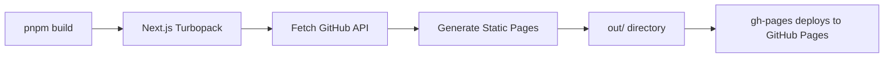

<p align="center">
  
</p>

<h1 align="center">Amr Elshabrawy — Portfolio</h1>

<p align="center">
  <strong>A professional, high-performance developer portfolio built with Next.js 16, React 19 & Tailwind CSS v4</strong>
</p>

<p align="center">
  <a href="https://amrelshabrawydev.github.io"></a>
  
  
  
  
  
</p>

---

## 📖 Table of Contents

- [Overview](#-overview)
- [Live Demo](#-live-demo)
- [Tech Stack & Why](#-tech-stack--why)
- [Project Structure](#-project-structure)
- [How It Works](#-how-it-works)
- [Data Fetching Strategy](#-data-fetching-strategy)
- [Styling & Design System](#-styling--design-system)
- [Components Architecture](#-components-architecture)
- [SEO & Performance](#-seo--performance)
- [Deployment](#-deployment)
- [Getting Started](#-getting-started)
- [Environment Variables](#-environment-variables)
- [Scripts](#-scripts)
- [License](#-license)

---

## 🌟 Overview

A fully static, blazing-fast developer portfolio that **automatically syncs with GitHub** to showcase projects. No CMS, no database — just push to GitHub and your portfolio updates itself on the next build.

### ✨ Key Features

| Feature                   | Description                                                                   |
| ------------------------- | ----------------------------------------------------------------------------- |
| **Auto-Synced Projects**  | Fetches all repositories from GitHub API at build time — no manual data entry |
| **Dynamic Project Pages** | Each repo gets its own detail page with full README rendering                 |
| **Contact Form**          | Functional email form powered by EmailJS — no backend needed                  |
| **Responsive Design**     | Pixel-perfect on every device, from 320px to 4K                               |
| **Terminal Brutalism**    | Dark "Catppuccin" aesthetic with Powerline-inspired UI components             |
| **GSAP Animations**       | High-performance timelines, custom masonry layouts, and scroll reveals        |
| **Full SEO**              | Structured data (JSON-LD), Open Graph, Twitter Cards, sitemap, robots.txt     |
| **Static Export**         | Pre-rendered to pure HTML/CSS/JS — deploys anywhere                           |

---

## 🔗 Live Demo

👉 **[amrelshabrawydev.github.io](https://amrelshabrawydev.github.io)**

---

## 🛠️ Tech Stack & Why

### Core Framework

| Technology                                        | Version   | Why We Use It                                                                                                                  |
| ------------------------------------------------- | --------- | ------------------------------------------------------------------------------------------------------------------------------ |
| **[Next.js](https://nextjs.org/)**                | `16.0.10` | App Router, static export (`output: "export"`), file-based routing, built-in image optimization, and Turbopack for fast builds |
| **[React](https://react.dev/)**                   | `19.2.0`  | Latest concurrent features, server components, improved performance with automatic batching                                    |
| **[TypeScript](https://www.typescriptlang.org/)** | `5.x`     | Type safety across the entire codebase — catches bugs at compile time, improves DX with autocomplete                           |

### Styling & Animations

| Technology                                      | Why We Use It                                                                                                                    |
| ----------------------------------------------- | -------------------------------------------------------------------------------------------------------------------------------- |
| **[Tailwind CSS v4](https://tailwindcss.com/)** | Hybrid engine with `@theme` first-class support. Native CSS variables and faster compilation for an optimized developer workflow |
| **[GSAP](https://greensock.com/gsap/)**         | The industry standard for high-performance animations. Precision timelines, ScrollTrigger, and complex DOM manipulation          |
| **[@gsap/react](https://gsap.com/react)**       | Official React wrapper for GSAP, providing `useGSAP` for safe lifecycle management and cleanup                                   |
| **[Lucide React](https://lucide.dev/)**         | Beautiful, consistent SVG icon set with tree-shaking — only imports icons we use                                                 |

### Data & Communication

| Technology                                                | Why We Use It                                                                                                  |
| --------------------------------------------------------- | -------------------------------------------------------------------------------------------------------------- |
| **[GitHub REST API v3](https://docs.github.com/en/rest)** | Fetches all public repositories, language stats, and README content at build time                              |
| **[EmailJS](https://www.emailjs.com/)**                   | Sends contact form emails directly from the browser — no backend, no server functions needed for static export |

### Markdown Rendering

| Technology                                                                                           | Why We Use It                                                                   |
| ---------------------------------------------------------------------------------------------------- | ------------------------------------------------------------------------------- |
| **[react-markdown](https://github.com/remarkjs/react-markdown)**                                     | Renders GitHub README files as React components                                 |
| **[remark-gfm](https://github.com/remarkjs/remark-gfm)**                                             | GitHub Flavored Markdown support (tables, strikethrough, task lists, autolinks) |
| **[rehype-raw](https://github.com/rehypejs/rehype-raw)**                                             | Allows raw HTML in markdown (for badges, images, etc.)                          |
| **[react-syntax-highlighter](https://github.com/react-syntax-highlighter/react-syntax-highlighter)** | Syntax highlighting for code blocks inside READMEs                              |

---

## 📁 Project Structure

```
amrelshabrawydev/
├── app/                          # Next.js App Router
│   ├── layout.tsx                # Root layout (fonts, metadata, navbar, footer)
│   ├── page.tsx                  # Home page → HeroSection
│   ├── globals.css               # Design system (Catppuccin theme, utilities)
│   ├── robots.ts                 # Dynamic robots.txt generation
│   ├── sitemap.ts                # Dynamic sitemap.xml generation
│   ├── about/page.tsx            # About page
│   ├── services/page.tsx         # Services page
│   ├── work/
│   │   ├── page.tsx              # Projects grid section
│   │   └── [slug]/page.tsx       # Dynamic project detail pages (ISR/Static)
│   └── contact/page.tsx          # Contact page
│
├── components/
│   ├── Layout/
│   │   ├── Navbar.tsx            # Navigation bar
│   │   └── Footer.tsx            # Persistent site footer
│   ├── Sections/
│   │   ├── HeroSection.tsx       # Hero with GSAP typewriter animation
│   │   ├── AboutSection.tsx      # Skills, experience, and bio
│   │   ├── ServicesSection.tsx   # Services offered
│   │   ├── ContactSection.tsx    # EmailJS-powered contact form
│   │   ├── GitHubProjectsSection.tsx  # Project grid (Masonry Layout)
│   │   ├── GitHubProjectsLoader.tsx   # Client-side projects entry point
│   │   └── GitHubProjects/
│   │       ├── ProjectCard.tsx   # Individual project card UI
│   │       ├── ProjectSkeleton.tsx  # Single card skeleton
│   │       └── ProjectSkeletonGrid.tsx # Full grid skeleton
│   └── ui/                       # Custom UI Components
│       ├── Powerline.tsx         # Terminal Powerline segments
│       ├── LogoIcon.tsx          # SVG Logo component
│       ├── ImageWithFallback.tsx # Optimized Next.js Image wrapper
│       └── markdown-components.tsx  # Custom markdown renderers
│
├── lib/
│   ├── github.ts                 # GitHub API service
│   ├── metadata.ts               # Centralized SEO metadata
│   └── utils.ts                  # Date and slug utilities
│
├── data/
│   └── index.tsx                 # Single source of truth for personal data
│
├── public/                       # Static assets
│   ├── logo.svg, profile.png     # Branding
│   └── .nojekyll                 # GitHub Pages compatibility
│
├── next.config.ts                # Next.js configuration
├── pnpm-lock.yaml                # Lockfile (pnpm preferred)
└── package.json                  # Dependencies & scripts
```

---

## ⚙️ How It Works

### Build Pipeline


```mermaid
graph LR
    A[pnpm build] --> B[Next.js Turbopack]
    B --> C[Fetch GitHub API]
    C --> D[Generate Static Pages]
    D --> E[out/ directory]
    E --> F[gh-pages deploys to GitHub Pages]
```

1. **`pnpm build`** triggers Next.js static export (`output: "export"`)
2. **Turbopack** compiles TypeScript and bundles assets
3. **Static Generation**: `generateStaticParams()` pre-fetches all projects to build dynamic detail pages
4. **Output**: A fully static `out/` directory ready for deployment
5. **`pnpm run deploy`**: Pushes the build to the `gh-pages` branch

### Runtime Behavior

- **GSAP Masonry**: A custom hook calculates column positions dynamically without heavy UI libraries.
- **Scroll Reveals**: Components use `useGSAP` + `ScrollTrigger` for smooth, performant entry animations.
- **Contact Form**: Uses EmailJS SDK to send emails directly from the client.

---

## 🔄 Data Fetching Strategy

### 1. GitHub Projects (Hybrid)

- **Static (Build-time)**: Project READMEs are fetched and converted to static HTML for SEO and speed.
- **Dynamic (Client-side)**: The projects grid fetches latest metadata on the `/work` page to ensure up-to-date stats.

### 2. Static Data (`data/index.tsx`)

Everything from skill proficiency to bio text is managed in a single file, acting as a lightweight headless CMS.

---

## 🎨 Styling & Design System

### Terminal Brutalism

The design is inspired by modern developer tools and terminals.

- **Theme**: Catppuccin-inspired dark palette.
- **Typography**: Space Grotesk (Headings) + JetBrains Mono (Body/Data).
- **Transitions**: Native CSS transitions mixed with GSAP timelines for precise motion.

---

## 🔍 SEO & Performance

- **[PageSpeed Insights Analysis](https://pagespeed.web.dev/analysis/https-amrelshabrawydev-github-io/378368sqd4?hl=en&form_factor=desktop)**: Independently audited for near-perfect Core Web Vitals.
  - ⚡ **Performance:** Highly optimized asset delivery, including WebP image conversions (reducing LCP overhead by 99%).
  - ♿ **Accessibility:** Semantic HTML and WCAG compliance (90+ score).
  - 🛠️ **Best Practices:** Modern web standards and error-free console (96+ score).
  - 🔎 **SEO:** Fully optimized metadata, sitemap, and robots.txt (100/100 score).
- **Next/Image**: Automatic optimization with fallback handling.
- **JSON-LD**: Proper structured data for personal brand and services.

---

## 🚀 Deployment

```bash
# Deploys directly to GitHub Pages
pnpm run deploy
```

---

## 🏁 Getting Started

```bash
# Clone and install
git clone https://github.com/AmrElshabrawyDev/amrelshabrawydev.github.io.git
cd amrelshabrawydev.github.io
pnpm install

# Start dev
pnpm dev
```

---

## 📄 License

This project is open-source and available under the [MIT License](LICENSE).

---

## 🤝 Get in Touch

<div align="center">

[](https://amrelshabrawydev.github.io) [](https://github.com/AmrElshabrawyDev) [](https://www.linkedin.com/in/amr-elshabrawy-dev) [](mailto:amrelshabrawy.dev@gmail.com) [](https://wa.me/201202546653) [](https://www.x.com/@AmrElshabr43803)

</div>

---

<div align="center">
  <h1 style="color: #3b82f6;">👨‍💻 AMR ELSHABRAWY</h1>
  
  <p style="color: #94a3b8;">
    Created with 💙 by <strong><a href="https://github.com/AmrElshabrawyDev">AMR ELSHABRAWY</a></strong> 🌟 &copy; 2026
  </p>
</div>
