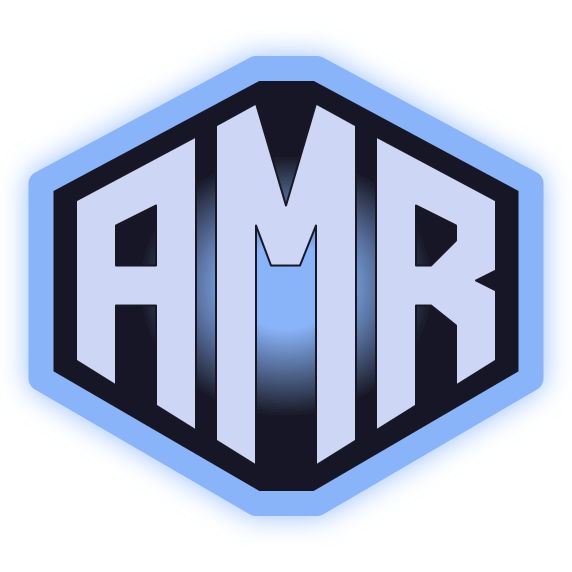
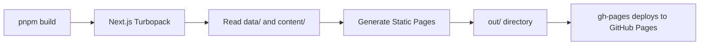

<p align="center">
  
</p>

<h1 align="center">Amr Elshabrawy — Portfolio</h1>

<p align="center">
  <strong>A professional, high-performance developer portfolio built with Next.js 16, React 19 & Tailwind CSS v4</strong>
</p>

<p align="center">
  <a href="https://amrelshabrawydev.github.io"></a>
  
  
  
  
  
</p>

---

## 📖 Table of Contents

- [Overview](#-overview)
- [Live Demo](#-live-demo)
- [Tech Stack & Why](#-tech-stack--why)
- [Project Structure](#-project-structure)
- [How It Works](#-how-it-works)
- [Data Fetching Strategy](#-data-fetching-strategy)
- [Styling & Design System](#-styling--design-system)
- [Components Architecture](#-components-architecture)
- [SEO & Performance](#-seo--performance)
- [Deployment](#-deployment)
- [Getting Started](#-getting-started)
- [Environment Variables](#-environment-variables)
- [Scripts](#-scripts)
- [License](#-license)

---

## 🌟 Overview

A fully static, blazing-fast developer portfolio with client case studies, a blog, and full SEO. No CMS, no database — projects and posts live in simple data and Markdown files.

### ✨ Key Features

| Feature                   | Description                                                                   |
| ------------------------- | ----------------------------------------------------------------------------- |
| **Case Studies**          | Curated projects with real screenshots and PageSpeed scores (`data/projects.ts`) |
| **Blog**                  | Markdown posts in English and Arabic (RTL) with RSS feed                      |
| **Contact Form**          | Functional email form powered by EmailJS — no backend needed                  |
| **Responsive Design**     | Pixel-perfect on every device, from 320px to 4K                               |
| **Terminal Brutalism**    | Dark "Catppuccin" aesthetic with Powerline-inspired UI components             |
| **GSAP Animations**       | High-performance timelines, custom masonry layouts, and scroll reveals        |
| **Full SEO**              | Structured data (JSON-LD), Open Graph, Twitter Cards, sitemap, robots.txt     |
| **Static Export**         | Pre-rendered to pure HTML/CSS/JS — deploys anywhere                           |

---

## 🔗 Live Demo

👉 **[amrelshabrawydev.github.io](https://amrelshabrawydev.github.io)**

---

## 🛠️ Tech Stack & Why

### Core Framework

| Technology                                        | Version   | Why We Use It                                                                                                                  |
| ------------------------------------------------- | --------- | ------------------------------------------------------------------------------------------------------------------------------ |
| **[Next.js](https://nextjs.org/)**                | `16.3`    | App Router, static export (`output: "export"`), file-based routing and Turbopack for fast builds                               |
| **[React](https://react.dev/)**                   | `19.2`    | Latest concurrent features, server components, improved performance with automatic batching                                    |
| **[TypeScript](https://www.typescriptlang.org/)** | `5.x`     | Type safety across the entire codebase — catches bugs at compile time, improves DX with autocomplete                           |

### Styling & Animations

| Technology                                      | Why We Use It                                                                                                                    |
| ----------------------------------------------- | -------------------------------------------------------------------------------------------------------------------------------- |
| **[Tailwind CSS v4](https://tailwindcss.com/)** | Hybrid engine with `@theme` first-class support. Native CSS variables and faster compilation for an optimized developer workflow |
| **[GSAP](https://greensock.com/gsap/)**         | The industry standard for high-performance animations. Precision timelines, ScrollTrigger, and complex DOM manipulation          |
| **[@gsap/react](https://gsap.com/react)**       | Official React wrapper for GSAP, providing `useGSAP` for safe lifecycle management and cleanup                                   |
| **[Lucide React](https://lucide.dev/)**         | Beautiful, consistent SVG icon set with tree-shaking — only imports icons we use                                                 |
| **[three.js](https://threejs.org/)**            | The home hero's interactive 3D block field — one instanced mesh, loaded lazily on desktop only                                   |

### Data & Communication

| Technology                                                | Why We Use It                                                                                                  |
| --------------------------------------------------------- | -------------------------------------------------------------------------------------------------------------- |
| **[EmailJS](https://www.emailjs.com/)**                   | Sends contact form emails directly from the browser — no backend, no server functions needed for static export |

### Markdown Rendering

| Technology                                                                                           | Why We Use It                                                                   |
| ---------------------------------------------------------------------------------------------------- | ------------------------------------------------------------------------------- |
| **[react-markdown](https://github.com/remarkjs/react-markdown)**                                     | Renders blog posts as React components                                          |
| **[remark-gfm](https://github.com/remarkjs/remark-gfm)**                                             | GitHub Flavored Markdown support (tables, strikethrough, task lists, autolinks) |
| **[gray-matter](https://github.com/jonschlinkert/gray-matter)**                                      | Reads blog post frontmatter (title, date, language, tags)                       |

---

## 📁 Project Structure

```
amrelshabrawydev/
├── app/                          # Next.js App Router
│   ├── layout.tsx                # Root layout (fonts, metadata, intro, navbar, footer)
│   ├── page.tsx                  # Home page
│   ├── globals.css               # Design system (Catppuccin theme, utilities)
│   ├── intro-gate.css            # The intro animation (logo + curtains)
│   ├── robots.ts / sitemap.ts    # robots.txt and sitemap.xml
│   ├── rss.xml/route.ts          # Blog RSS feed
│   ├── about/ services/ contact/ # Pages
│   ├── work/                     # Case studies grid + [slug] detail pages
│   └── blog/                     # Blog list + [slug] article pages
│
├── components/
│   ├── Layout/                   # Navbar, Footer
│   ├── Sections/
│   │   ├── HeroSection.tsx       # Home hero (CSS entrance + 3D background)
│   │   ├── Hero3D/               # three.js block field (loaded lazily)
│   │   ├── Home/HomeSections.tsx # Home page sections (services, work, FAQ…)
│   │   ├── Reviews/              # Client reviews (EN translation / AR original)
│   │   ├── CaseStudies/          # Cards, grid, /work hero, detail view
│   │   └── About/Services/ContactSection.tsx
│   ├── Blog/PostCard.tsx
│   └── ui/                       # Shared UI
│       ├── IntroGate.tsx         # Intro markup (timeline in app/intro-gate.css)
│       ├── PageHeader.tsx        # Top of every page: badge → H1 → intro
│       ├── SectionHeader.tsx     # Section titles: eyebrow → H2 → text
│       ├── Powerline.tsx         # Terminal Powerline segments
│       ├── LogoIcon.tsx + logoPaths.ts  # The logo (single source for all uses)
│       └── CtaBanner.tsx, WhatsAppButton.tsx
│
├── content/blog/                 # Blog posts (Markdown, EN + AR)
├── data/
│   ├── index.tsx                 # Personal info, services, skills, FAQ, reviews
│   └── projects.ts               # Case studies (all projects on /work)
│
├── lib/
│   ├── intro-gate.ts             # Intro scripts (mode, skip, landing measurement)
│   ├── blog.ts                   # Markdown blog loader
│   ├── seo.ts / metadata.ts      # Metadata + JSON-LD helpers
│   ├── site.ts                   # Site URL, social links, WhatsApp link
│   ├── analytics.ts              # GA4 lead events
│   └── utils.ts                  # Slug + number helpers
│
├── public/                       # Images, CV, icons, OG images
└── next.config.ts
```

---

## ⚙️ How It Works

### Build Pipeline


```mermaid
graph LR
    A[pnpm build] --> B[Next.js Turbopack]
    B --> C[Read data/ and content/]
    C --> D[Generate Static Pages]
    D --> E[out/ directory]
    E --> F[gh-pages deploys to GitHub Pages]
```

1. **`pnpm build`** triggers Next.js static export (`output: "export"`)
2. **Turbopack** compiles TypeScript and bundles assets
3. **Static Generation**: `generateStaticParams()` builds a page for every case study and blog post
4. **Output**: A fully static `out/` directory ready for deployment
5. **`pnpm run deploy`**: Pushes the build to the `gh-pages` branch

### Runtime Behavior

- **Intro**: on every full page load the logo is traced in light, fills in while `npm run build` types, then flies into the header as the curtains open (~2.5s, pure CSS, skippable with any click/key, off for reduced motion).
- **Home 3D hero**: a three.js block field, loaded on desktop only after the first interaction / idle, skipped without a GPU.
- **Portfolio grid**: every project uses the same card, with Client / Personal / Concept filters.
- **Scroll Reveals**: Components use `useGSAP` + `ScrollTrigger` for smooth, performant entry animations.
- **Contact Form**: Uses EmailJS SDK to send emails directly from the client (with spam protection, see Security).

---

## 🔄 Data Fetching Strategy

### 1. Projects (`data/projects.ts`)

All projects are curated by hand — no API calls at build time, so builds never fail because of GitHub rate limits.

### 2. Static Data (`data/index.tsx`)

Everything from skill proficiency to bio text is managed in a single file, acting as a lightweight headless CMS.

---

## 🎨 Styling & Design System

### Terminal Brutalism

The design is inspired by modern developer tools and terminals.

- **Theme**: Catppuccin-inspired dark palette.
- **Typography**: Space Grotesk (Headings) + JetBrains Mono (Body/Data).
- **Transitions**: Native CSS transitions mixed with GSAP timelines for precise motion.

---

## 🔍 SEO & Performance

- **[PageSpeed Insights Analysis](https://pagespeed.web.dev/analysis/https-amrelshabrawydev-github-io/378368sqd4?hl=en&form_factor=desktop)**: Independently audited for near-perfect Core Web Vitals.
  - ⚡ **Performance:** Highly optimized asset delivery, including WebP image conversions (reducing LCP overhead by 99%).
  - ♿ **Accessibility:** Semantic HTML and WCAG compliance (90+ score).
  - 🛠️ **Best Practices:** Modern web standards and error-free console (96+ score).
  - 🔎 **SEO:** Fully optimized metadata, sitemap, and robots.txt (100/100 score).
- **Next/Image**: Automatic optimization with fallback handling.
- **JSON-LD**: Person, WebSite, ProfessionalService, FAQPage, BlogPosting, CreativeWork and BreadcrumbList.
- **Per-page canonicals**: every page sets its own canonical via `buildMetadata()` in `lib/seo.ts`.
- **Growth plan**: keyword research and content roadmap in [`docs/SEO-GROWTH-PLAN.md`](docs/SEO-GROWTH-PLAN.md).

---

## ✍️ Content: Case Studies & Blog

### Add a case study

1. Add an entry to `caseStudies` in [`data/projects.ts`](data/projects.ts) and use `...media("<slug>")`.
2. Add the images to `public/projects/<slug>/`: `cover.webp` (1600×1000), `desktop.webp`, `mobile.webp`, `psi-desktop.webp`, `psi-mobile.webp`.
3. Add the PageSpeed scores in `performance: { desktop, mobile }`.

### Write a blog post

Create `content/blog/<slug>.md`:

```md
---
title: "Post title (≤ 60 characters)"
description: "Meta description, 140–160 characters"
date: "2026-09-26"
lang: "en"          # or "ar" for Arabic (RTL)
tags: ["Next.js", "SEO"]
---

Your article in Markdown…
```

The post is added automatically to `/blog`, the homepage, `sitemap.xml` and `rss.xml`.

---

## 🧰 Editing & Previews

| I want to…                         | Where                                                                   |
| ---------------------------------- | ----------------------------------------------------------------------- |
| Add a client review                | `testimonialData` + `reviewSource.count` in `data/index.tsx`            |
| Add a skill / tool                 | `aboutData.skillCategories` in `data/index.tsx` (link its case studies) |
| Add a case study                   | `data/projects.ts` + images in `public/projects/<slug>/`                |
| Change the intro speed             | `--gs` in `app/intro-gate.css` (1 = ~2.5s, 1.5 = slower)                |
| Change the logo                    | `components/ui/logoPaths.ts` (used by the header, footer and intro)    |

Preview helpers (add to any URL):

- `?gate` — always play the intro (even with reduced motion on)
- `?gate=debug` — also log the intro's landing measurements to the console
- `?3d` — force the home 3D scene on machines without a GPU

---

## 🔒 Security

- No secrets in the code: the only env vars are EmailJS's **public** IDs (`.env.example`); `.env*.local` is git-ignored.
- JSON-LD is escaped (`jsonLd()` in `lib/seo.ts`), RSS text is XML-escaped, blog Markdown renders without raw HTML, and every external link uses `rel="noopener noreferrer"`.
- Contact form: honeypot field for bots, one message per browser every 30s (EmailJS `limitRate`), and field length limits.
  In the EmailJS dashboard also turn on **Account → Security → allowed domains** (your site's domain) and, if spam appears, **reCAPTCHA** on the template.
- Check dependencies with `pnpm audit` before deploying.

---

## 🚀 Deployment

```bash
# Deploys directly to GitHub Pages
pnpm run deploy
```

---

## 🏁 Getting Started

```bash
# Clone and install
git clone https://github.com/AmrElshabrawyDev/amrelshabrawydev.github.io.git
cd amrelshabrawydev.github.io
pnpm install

# Start dev
pnpm dev
```

---

## 📄 License

This project is open-source and available under the [MIT License](LICENSE).

---

## 🤝 Get in Touch

<div align="center">

[](https://amrelshabrawydev.github.io) [](https://github.com/AmrElshabrawyDev) [](https://www.linkedin.com/in/amr-elshabrawy-dev) [](mailto:amrelshabrawy.dev@gmail.com) [](https://wa.me/201202546653) [](https://www.x.com/@AmrElshabr43803)

</div>

---

<div align="center">
  <h1 style="color: #3b82f6;">👨‍💻 AMR ELSHABRAWY</h1>
  
  <p style="color: #94a3b8;">
    Created with 💙 by <strong><a href="https://github.com/AmrElshabrawyDev">AMR ELSHABRAWY</a></strong> 🌟 &copy; 2026
  </p>
</div>
